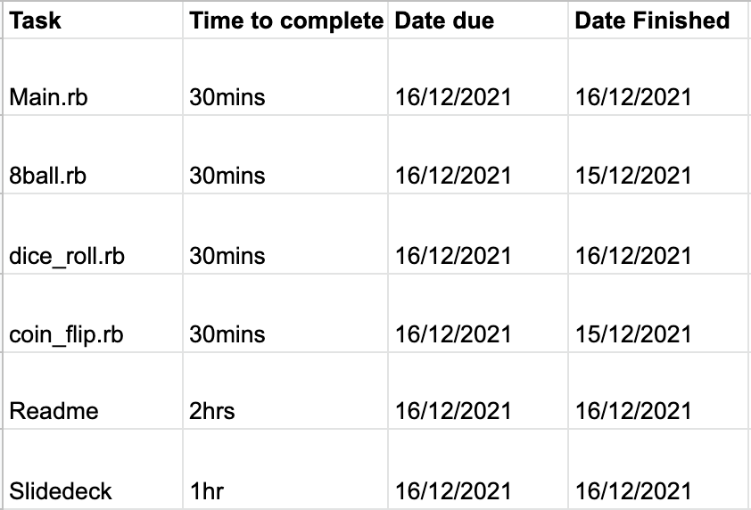

# Kyle Corlett T1A3

[GitHub Repository](https://github.com/KyleCorlett/KyleCorlett_T1A3.git)  
[Trello Board](https://trello.com/b/NLdi1A2S/kylecorlettt1a3)

## Description

This is my terminal application built with Ruby. It is a Chance game with three options to use. These options will be a Magic 8 Ball, where the application gives you a space to write an answer, after you have entered in your text it pulls a random answer from the stored array and displays the answer after and along side the question the user has inputted, if the user ask the question "What is the meaning of life?" it will answer "42".

The second option will be to roll a dice, the user will select roll the dice of the menu and the application will ask the user to enter the key word "Lucky" and then it will pull a random value from a stored array and match it to variables with values and text images between 1 and 6 and display it to the user.

The last and final option will be a simple coin flip, where the user will select to flip the coin and the application will use pull a random value from a stored array that store a heads or tails value and will display the random value to the user.

After each game has completed it will bring the user automatically back to the main menu where they have the option to exit the program completely.

I am creating this program as some times you just need an extra hand deciding something, or cant quite figure out what to do, so you need something to push you in the right direction. This is for people who like me are very indecisive and poor at making decisions, I hope to help people who would end up starving because they couldn't decide what to have for dinner. People will be able to download my application and use it when they are in need of a quick decision.

## How to run application

To install the application you must follow these steps.

### Method one

- Install ruby to your computer, follow this link for instructions (<https://www.ruby-lang.org/en/documentation/installation/>)
- Go to the GitHub repo linked up the top or (<https://github.com/KyleCorlett/KyleCorlett_T1A3.git>)
- Clone or download repository onto your machine (Unzip if you downloaded it)
- Open your preferred terminal application, and navigate to the cloned or unzipped folder, then into src folder
- In the terminal run the code bash chance.sh
- Enter your name when prompted
- The application will now run

### Method Two

- Install ruby to your computer, follow this link for instructions (<https://www.ruby-lang.org/en/documentation/installation/>)
- Go to the GitHub repo linked up the top or (<https://github.com/KyleCorlett/KyleCorlett_T1A3.git>)
- Clone or download repository onto your machine (Unzip if you downloaded it)
- Open your preferred terminal application, and navigate to the cloned or unzipped folder, then into src folder
- In your terminal run gem install bundle
- In your terminal run bundle install
- In your terminal run ruby main.rb NAME (Insert your name where NAME is)
- The application will now run

Program runs on Linux and Mac OS, have not confirmed on Windows, built with ruby 3.0.0

## Features (Develop a list of features that will be included in the application)

### The features of this application

- The Magic 8 Ball game, has a prompt to make sure you want to enter the method using tty prompt and a loop to verify your selection. I then has a hidden feature using a loop to provide the user with a specific answer when the question "What is the meaning on life?". There is a rescue for error handling if the user enters no information when they ask a question.
- The roll the dice uses an array with external variables to provide the user a random variable during the games use. To start the roll of the dice the user is required to type "Lucky", there is an auto capitalize function to help if the user doesn't type a capital it will still recognize the word. If the user enters the wrong information it will provide an error and allow the user to retry using a rescue.
- There is a feature when you first launch the application in the bash script to enter your name, it then stores that name in an array. The main ruby script then pulls that information from the array in the bash script and converts it to a variable I can use to give the user a custom greeting. If the user does not enter anything for a name, it has a different greeting that is not personal and just generic.

## User Interaction (Develop an outline of the user interaction and experience for the application)

Users when the load the Chance.sh file will be run through the installation set up, and asked to enter their name. Once the bash script has the name, it stores it in an array. Once the user has entered a name it will load the program, the main ruby code receives that array, if the array is empty it will display a set message saying "Welcome to the Chance Game!!, if the array has any value in it, it will auto capitalize the first letter, and then display "Hello (Insert name), Welcome to the Chance Game!!" they will also be greeted with a title and the game options in a list format (Magic 8 ball, Roll the dice, Coin flip, Exit). They will be able to use the up and down arrows to move between options and then use enter to select which option they are currently on, which will have a little statement above the options telling them how to navigate.

If they select the Magic 8 Ball option they will be be asked if they wish to ask a question (Yes/No), if they select no it will take them back to main menu, if they select yes they will be greeted with a graphical title saying "Magic 8 Ball", and a line that says "What question do you have for the Magic 8 Ball today?" followed by a space to input their question. Once the user has inputted their question, which can be anything, or any value, it will run the random generator program and select a random answer from a set of pre defined answers. It will the display that answer after it displays the original question. If they type "What is the meaning of life?" it will return "42". If the user does not input anything it will raise and error and display "You want to ask something? " and then re run the program. After the answer has been displayed they will be given an instruction to hit any key, and that will take them back to the main menu.

If they select the Roll The Dice option it will display a graphical title of "Roll The Dice", with a statement telling them to enter the word "Lucky", If they type it correctly it will roll the dice it will run the program to generate a random number between 1 and 6, once that has run it will display the number to the user along with a graphical picture of what the dice would look like, and then return to the main menu. There is an auto capitalize on the input so it will always match lucky even if they don't input it with a capital letter. If they do not enter the right word it will give the user a little error message saying "Please retry: " and then will re run the program.

If they select Coin Flip it will display a graphical title of "Coin Flip", it will give them a command to hit 'Enter" to flip the coin. When they hit 'Enter' it will run the flip the coin the program, and pull a random value from a stored array. The program will the display "Heads" or "Tails", and then exit to the main menu. There is no error handling on this as the user can hit any key and it will run.

## Develop a diagram which describes the control flow of your application

## Implementation Plan

### Trello

I used trello to keep track of my requirements and put little messages when I updated my code, or completed a task. Here are some screen shots, the rest are stored in ./docs/Screen_shots_dated.

### Spreadsheet

I also used a spreadsheet to give me estimated times to complete tasks.

## Testing

### Manual test sheet

